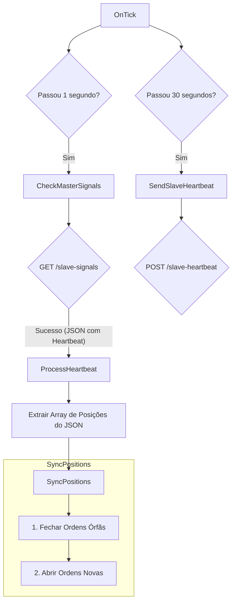

# Manual do Programador - Slave MT4

**Versão:** 4.02
**Plataforma:** MetaTrader 4
**Autor:** Sentra Partners
**Data:** Outubro 2025

---

## Índice

1. [Visão Geral e Diferenças (MT4 vs MT5)](#visão-geral-e-diferenças-mt4-vs-mt5)
2. [Arquitetura do Sistema](#arquitetura-do-sistema)
3. [Estrutura do Código](#estrutura-do-código)
4. [Ciclo de Vida da Sincronização](#ciclo-de-vida-da-sincronização)
5. [Comunicação com a API](#comunicação-com-a-api)
6. [Lógica de Sincronização (`SyncPositions`)](#lógica-de-sincronização-syncpositions)
7. [Gerenciamento de Lote e Risco](#gerenciamento-de-lote-e-risco)
8. [Normalização de Símbolos](#normalização-de-símbolos)
9. [Limitações e Soluções](#limitações-e-soluções)

---

## Visão Geral e Diferenças (MT4 vs MT5)

O **Slave MT4** é a contraparte para MetaTrader 4 do EA seguidor. Sua função é consultar a API da Sentra Partners para obter o estado completo das posições da conta Master e replicá-las na conta local. Devido às limitações do MQL4, a arquitetura é focada em **sincronização de estado** em vez de processamento de eventos discretos.

### Principais Diferenças da Versão MT5

| Característica | Versão MT5 (MQL5) | Versão MT4 (MQL4) |
| :--- | :--- | :--- |
| **Mecanismo Principal** | Polling de eventos (`open`, `close`, `heartbeat`) | Polling de **apenas um** evento: `heartbeat`. |
| **Fonte da Verdade** | A API envia o último evento que ocorreu. | A API envia o **estado completo e atual** das posições do Master. |
| **Lógica de Cópia** | Reage a eventos específicos (Ex: `ProcessOpenEvent`). | Realiza uma **sincronização completa** (`SyncPositions`) a cada resposta da API. |
| **Gerenciamento de Posições** | Usa `structs` e arrays para mapear tickets. | Usa o campo **`OrderComment()`** para armazenar o ticket da ordem Master. |
| **Parsing de JSON** | Funções de extração para cada campo. | Parsing manual e complexo da string JSON para iterar pelas posições. |

Em essência, o Slave MT4 não se importa com *o que aconteceu* no Master (se uma ordem foi aberta ou fechada). Ele apenas se importa com *qual é o estado atual* e força a conta local a espelhar esse estado.

---

## Arquitetura do Sistema

O Slave MT4 opera em um ciclo de `OnTick`, que serve como um timer manual para fazer consultas periódicas à API.

### Diagrama de Fluxo



### Lógica Central

1.  **`OnTick()`**: Funciona como um loop principal. A cada tick, verifica se já passou o `CheckInterval` (1 segundo) para chamar `CheckMasterSignals`.
2.  **`CheckMasterSignals()`**: Monta a URL e faz a chamada `GET` para a API. O endpoint é o mesmo do MT5, mas o EA só está interessado em respostas que contenham `"action":"heartbeat"`.
3.  **`ProcessHeartbeat(string json)`**: Extrai a porção do JSON que contém o array de posições do Master.
4.  **`SyncPositions(string positionsJson)`**: O coração do EA. Recebe a string do array de posições e executa um algoritmo de duas fases para sincronizar o estado.

---

## Estrutura do Código

### Organização do Arquivo

```mql4
// Propriedades e Licenciamento

// Parâmetros de Entrada
input string UserEmail = "";
input string MasterAccountNumber = "";

// Variáveis Globais
datetime lastCheckTime = 0;
datetime lastHeartbeatTime = 0;

// Funções de Evento MQL4
int OnInit() { ... }
void OnTick() { ... }

// Funções de Comunicação e Processamento
void CheckMasterSignals() { ... }
void ProcessHeartbeat(string json) { ... }

// Função de Sincronização Principal
void SyncPositions(string positionsJson) { ... }

// Funções de Abertura/Fechamento de Ordem
bool OpenOrder(...) { ... }
bool CloseOrder(...) { ... }

// Funções Auxiliares
double AdjustLotForAccountType(double lots) { ... }
string NormalizeSymbol(string symbol) { ... }
string ExtractValue(string text, string key) { ... }
```

### Parâmetros de Entrada Chave

-   `UserEmail`: Email da conta slave.
-   `MasterAccountNumber`: Número da conta master a ser copiada.
-   `LotMultiplier`: Fator de multiplicação para o lote.
-   `MasterIsCent` / `SlaveIsCent`: Crucial para o ajuste correto do lote entre contas de tipos diferentes.
-   `MagicNumber`: Identificador único para as ordens abertas pelo EA.

---

## Ciclo de Vida da Sincronização

A cada `CheckInterval` (1s), o seguinte ciclo ocorre:

1.  **Consulta**: `CheckMasterSignals` busca o estado atual do Master na API.
2.  **Recebimento**: A API retorna um JSON contendo o `heartbeat` do Master, que inclui um array de todas as suas posições abertas.
3.  **Sincronização (`SyncPositions`)**: Esta função é chamada e executa duas tarefas principais:
    1.  **Fase 1: Fechar Órfãs**: O EA itera por todas as ordens abertas na conta slave (`OrdersTotal()`) que pertencem a ele (filtrando pelo `MagicNumber`). Para cada ordem, ele lê o `OrderComment()`, que armazena o ticket da ordem Master original. Ele então verifica se esse ticket Master **ainda existe** na string JSON recebida. Se não existir, a ordem é considerada "órfã" e é fechada com `CloseOrder()`.
    2.  **Fase 2: Abrir Novas**: O EA itera pela string JSON das posições do Master. Para cada posição Master, ele extrai o ticket e verifica se já existe uma ordem correspondente aberta na conta slave (novamente, checando o `OrderComment()` de todas as ordens do EA). Se não existir, a posição é considerada "nova" e o EA chama `OpenOrder()` para copiá-la.

Este ciclo garante que, a cada segundo, a conta slave converge para o estado exato da conta master.

---

## Comunicação com a API

-   **`CheckMasterSignals()`**: Faz a requisição `GET` para `/slave-signals`.
    -   A v4.02 corrige a URL para passar os parâmetros corretos: `master_account_id` e `slave_email`.
-   **`SendSlaveHeartbeat()`**: Faz uma requisição `POST` para `/slave-heartbeat` a cada 30 segundos para manter o status "Online" na plataforma.

### Parsing de JSON em MQL4

Como MQL4 não tem bibliotecas nativas de JSON, o parsing é feito manualmente com funções de string, o que é mais complexo e frágil do que no MQL5.

-   **`ProcessHeartbeat`**: Usa `StringFind` para localizar o início e o fim do array `"positions":[...]`.
-   **`SyncPositions`**: Itera pela string do array de posições usando `StringFind` para localizar cada `"ticket":...` e, a partir daí, extrai o bloco `{...}` daquela posição para então usar `ExtractValue`.
-   **`ExtractValue(string text, string key)`**: Uma função auxiliar que busca uma chave (ex: `"symbol"`) e retorna o valor associado, lidando com aspas e vírgulas. É a base de todo o parsing.

---

## Lógica de Sincronização (`SyncPositions`)

Esta é a função mais importante do EA.

### Fase 1: Fechar Posições Órfãs

```mql4
for(int i = OrdersTotal() - 1; i >= 0; i--) {
    if(OrderSelect(i, SELECT_BY_POS, MODE_TRADES)) {
        if(OrderMagicNumber() == MagicNumber) {
            int masterTicket = OrderComment();
            
            // Se o ticket do master não está no JSON, a ordem é órfã.
            if(StringFind(positionsJson, "\"ticket\":" + masterTicket) < 0) {
                CloseOrder(OrderTicket());
            }
        }
    }
}
```

### Fase 2: Abrir Novas Posições

```mql4
// Loop através da string JSON
while(true) {
    int ticketPos = StringFind(positionsJson, "\"ticket\":", search);
    if(ticketPos < 0) break; // Fim do JSON
    
    // Extrai o masterTicket
    ...
    
    // Verifica se já existe uma ordem com este masterTicket no comentário
    bool exists = false;
    for(int i = 0; i < OrdersTotal(); i++) {
        if(OrderSelect(...) && OrderComment() == masterTicket) {
            exists = true;
            break;
        }
    }
    
    // Se não existe, abre a ordem
    if(!exists) {
        // Extrai todos os outros dados (symbol, lots, etc.) do bloco JSON
        ...
        OpenOrder(...);
    }
    
    search = ticketEnd; // Continua a busca a partir do final do ticket atual
}
```

---

## Gerenciamento de Lote e Risco

O cálculo de lote é idêntico ao da versão MT5, garantindo consistência.

1.  **Lote Base**: Lote recebido do JSON do Master.
2.  **Ajuste de Conta Cent (`AdjustLotForAccountType`)**: Ajusta o lote se os tipos de conta (Cent/Standard) forem diferentes.
3.  **Multiplicador de Lote**: Aplica o `LotMultiplier` do input.
4.  **Normalização de Lote (`NormalizeLot`)**: Ajusta o lote final para os requisitos da corretora (passo, mínimo, máximo) usando `MarketInfo`.

## Normalização de Símbolos

A função `NormalizeSymbol` é crucial e mais complexa no MT4.

1.  Tenta o símbolo exato.
2.  Se falhar, tenta remover sufixos conhecidos (ex: de `EURUSDc` para `EURUSD`).
3.  Se ainda falhar, tenta adicionar sufixos conhecidos (ex: de `EURUSD` para `EURUSD.m`).

Isso é necessário porque `MarketInfo` no MT4 só funciona para símbolos que estão na "Observação de Mercado", então `SymbolSelect(symbol, true)` é chamado antes de cada tentativa para garantir que o símbolo esteja visível para o terminal.

---

## Limitações e Soluções

-   **Parsing de JSON Frágil**: O parsing manual de strings pode quebrar se a API mudar a ordem dos campos no JSON. A solução é manter um formato de API estável.
-   **Ausência de Eventos Reais**: A dependência do `OnTick` significa que, em um mercado parado, não há execução de código. A solução é que, mesmo em um mercado parado, o `OnTick` é chamado periodicamente (geralmente a cada segundo), garantindo que o `CheckInterval` seja respeitado.
-   **Armazenamento de Ticket no Comentário**: Usar `OrderComment()` para armazenar o ticket do master é uma solução inteligente, mas impede que o usuário ou outro EA use o campo de comentário para outros fins naquelas ordens.

---

**Documento criado por:** Manus AI
**Última atualização:** 31 de Outubro de 2025
