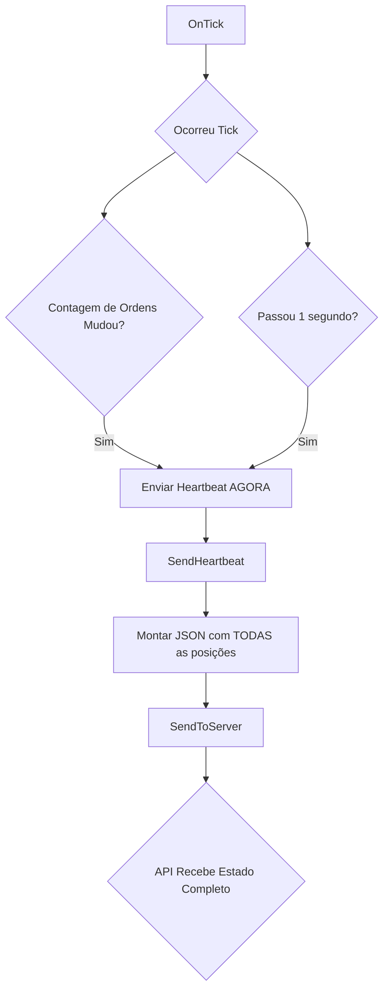

# Manual do Programador - Master MT4

**Versão:** 4.0
**Plataforma:** MetaTrader 4
**Autor:** Sentra Partners
**Data:** Outubro 2025

---

## Índice

1. [Visão Geral e Diferenças (MT4 vs MT5)](#visão-geral-e-diferenças-mt4-vs-mt5)
2. [Arquitetura do Sistema](#arquitetura-do-sistema)
3. [Estrutura do Código](#estrutura-do-código)
4. [Funções Principais](#funções-principais)
5. [Mecanismo de Detecção de Mudanças](#mecanismo-de-detecção-de-mudanças)
6. [Comunicação com API](#comunicação-com-api)
7. [Limitações e Soluções](#limitações-e-soluções)
8. [Licenciamento](#licenciamento)

---

## Visão Geral e Diferenças (MT4 vs MT5)

O **Master MT4** é a versão para MetaTrader 4 do EA provedor de sinais. Sua função é capturar todas as operações da conta e enviá-las para a API da Sentra Partners, atuando como a fonte para o sistema de copy trading. A versão 4.0 foi simplificada para focar em um único mecanismo robusto: o **heartbeat de sincronização**.

### Principais Diferenças da Versão MT5

Devido às limitações da linguagem MQL4 e da arquitetura do MT4, a abordagem é fundamentalmente diferente:

| Característica | Versão MT5 (MQL5) | Versão MT4 (MQL4) |
| :--- | :--- | :--- |
| **Mecanismo de Eventos** | `OnTradeTransaction()` (preciso e instantâneo) | `OnTick()` (baseado em ticks de preço) |
| **Detecção de Mudanças** | Detecção granular de Abertura, Fechamento e Modificação. | Detecção baseada na **mudança do número total de ordens** (`OrdersTotal()`). |
| **Envio de Sinais** | Envia eventos específicos (`open`, `close`, `modify`). | Envia **apenas um tipo de evento: `heartbeat`**, que contém o estado completo de todas as posições. |
| **Fila de Retentativas** | Implementada com `structs` e arrays dinâmicos. | **Não implementada** na v4.0 para manter a simplicidade e performance no ambiente MQL4. A confiabilidade depende da frequência do heartbeat. |
| **Timer** | `EventSetTimer()` (nativo e preciso) | Manual, dentro do `OnTick()`, baseado na comparação de `TimeCurrent()`. |

Em resumo, enquanto a versão MT5 é reativa e envia eventos específicos, a versão MT4 é **proativa e baseada em estado**, enviando um snapshot completo do sistema a cada mudança ou a cada segundo.

---

## Arquitetura do Sistema

### Diagrama de Fluxo



### Lógica Central

A lógica do Master MT4 é um loop contínuo dentro do `OnTick()` que faz duas verificações:

1.  **Mudança Imediata:** O número atual de ordens (`OrdersTotal()`) é diferente do número anterior (`previousOrdersCount`)? Se sim, uma ordem foi aberta ou fechada. O sistema envia um heartbeat **imediatamente** para notificar a API sobre o novo estado.
2.  **Sincronização Periódica:** Já passou 1 segundo desde o último heartbeat (`now - lastHeartbeatTime >= HeartbeatInterval`)? Se sim, envia um heartbeat para garantir que o estado esteja sempre sincronizado, mesmo que não haja novas operações.

Esta abordagem dupla garante tanto a **rapidez** (reação a mudanças) quanto a **robustez** (sincronização periódica).

---

## Estrutura do Código

### Organização do Arquivo

```mql4
// Propriedades
#property version   "4.00"

// Sistema de Licenciamento
#define LICENSE_EXPIRY_DATE D'2025.12.31'

// Parâmetros de Entrada
input string UserEmail = "";
input int HeartbeatInterval = 1;

// Variáveis Globais
datetime lastHeartbeatTime = 0;
int previousOrdersCount = 0;

// Funções de Evento MQL4
int OnInit() { ... }
void OnTick() { ... }
void OnDeinit(...) { ... }

// Função de Envio Principal
void SendHeartbeat() { ... }

// Função de Comunicação
void SendToServer(string data) { ... }

// Função de Validação
bool ValidateLicense() { ... }
```

### Variáveis Globais

-   `lastHeartbeatTime`: `datetime` que armazena o timestamp do último envio bem-sucedido. Essencial para o controle do timer manual.
-   `previousOrdersCount`: `int` que armazena o valor de `OrdersTotal()` do tick anterior. Essencial para detectar a abertura ou fechamento de ordens.

### Parâmetros de Entrada

| Parâmetro | Tipo | Padrão | Descrição |
| :--- | :--- | :--- | :--- |
| `UserEmail` | `string` | "" | Email do usuário cadastrado na plataforma. **Obrigatório**. |
| `MasterServer` | `string` | `https://sentrapartners.com/api/mt/copy` | URL base da API de copy trading. |
| `HeartbeatInterval` | `int` | 1 | Intervalo em segundos para o envio do heartbeat de sincronização. **1 segundo é o ideal**. |
| `EnableLogs` | `bool` | `true` | Ativa/desativa logs detalhados no terminal. |

---

## Funções Principais

### `OnInit()`

1.  **Validação:** Verifica a licença e os parâmetros de entrada.
2.  **Inicializa Contador:** Define `previousOrdersCount = OrdersTotal()` para ter um ponto de partida para a detecção de mudanças.

### `OnTick()`

Esta é a função que executa a cada novo preço recebido do servidor. O código é otimizado para ser o mais leve possível.

1.  Obtém o tempo atual e a contagem de ordens.
2.  **Verifica se `currentOrdersCount != previousOrdersCount`**. Se for diferente, chama `SendHeartbeat()` imediatamente, atualiza o contador e reseta o timer do heartbeat.
3.  **Verifica se `now - lastHeartbeatTime >= HeartbeatInterval`**. Se o tempo passou, chama `SendHeartbeat()` e atualiza o timer.

```mql4
void OnTick() {
    datetime now = TimeCurrent();
    int currentOrdersCount = OrdersTotal();
    
    // Detecção de mudança
    if(currentOrdersCount != previousOrdersCount) {
        if(EnableLogs) Print("🔔 Mudança detectada...");
        SendHeartbeat();
        previousOrdersCount = currentOrdersCount;
        lastHeartbeatTime = now;
    }
    
    // Heartbeat periódico
    if(now - lastHeartbeatTime >= HeartbeatInterval) {
        SendHeartbeat();
        lastHeartbeatTime = now;
    }
}
```

---

## Mecanismo de Detecção de Mudanças

Como o MQL4 não possui um sistema de eventos de trade tão sofisticado quanto o MQL5, a detecção de mudanças é mais simples, porém eficaz para o propósito.

-   **Abertura de Ordem:** `currentOrdersCount` será **maior** que `previousOrdersCount`.
-   **Fechamento de Ordem:** `currentOrdersCount` será **menor** que `previousOrdersCount`.

Em ambos os casos, a condição `!=` é satisfeita, e o estado completo das posições é enviado. A API no lado do servidor é responsável por comparar o estado recebido com o estado anterior e inferir o que aconteceu (qual ordem foi aberta ou fechada).

**E as modificações (SL/TP)?**

A detecção de modificações de Stop Loss e Take Profit não é tratada de forma reativa neste modelo. No entanto, como o heartbeat é enviado a cada segundo, qualquer modificação de SL/TP será refletida no sistema slave **em no máximo 1 segundo**, o que é suficientemente rápido para a maioria dos cenários de copy trading.

---

## Comunicação com API

### `SendHeartbeat()`

Esta é a única função que monta e envia dados para a API.

1.  **Inicia o JSON:** Cria a estrutura base com `action: "heartbeat"` e os dados da conta master.
2.  **Itera pelas Ordens:** Faz um loop de `0` a `OrdersTotal()`.
3.  **Seleciona e Filtra:** Usa `OrderSelect(i, SELECT_BY_POS, MODE_TRADES)` para acessar cada ordem. Filtra para incluir apenas ordens de mercado (`OrderType() <= 1`, ou seja, `OP_BUY` ou `OP_SELL`).
4.  **Monta o Objeto da Posição:** Para cada ordem válida, adiciona um objeto JSON ao array `positions` com todos os dados relevantes (`ticket`, `symbol`, `lots`, `open_price`, `stop_loss`, `take_profit`, etc.).
5.  **Finaliza e Envia:** Fecha o JSON e o passa para a função `SendToServer()`.

### `SendToServer(string data)`

Função idêntica à da versão MT5, responsável por encapsular o `WebRequest`.

-   **Endpoint:** `MasterServer + "/master-signal"`
-   **Método:** `POST`
-   **Tratamento de Erro:** Loga erros HTTP no terminal, com uma mensagem especial para o erro `4060` (URL não autorizada), instruindo o usuário a configurar o WebRequest nas opções do MT4.
-   **Sem Fila de Retentativa:** Se a requisição falhar, a mensagem é perdida. A confiabilidade é garantida pelo próximo heartbeat (que ocorrerá no máximo 1 segundo depois).

---

## Limitações e Soluções

-   **Falta de Eventos Granulares:** A maior limitação do MQL4. A solução foi usar um modelo baseado em estado (`heartbeat`) em vez de eventos. A API do lado do servidor precisa ser inteligente para processar esses snapshots de estado.
-   **Ausência de Fila de Retentativa:** Para simplificar o código em MQL4 e evitar a complexidade de gerenciar arrays de `structs`, a fila não foi implementada. A alta frequência do heartbeat (1 segundo) mitiga o risco de perda de dados. Se um sinal falhar, o próximo, um segundo depois, corrigirá o estado.
-   **Performance do `OnTick()`:** Em mercados muito voláteis, o `OnTick()` pode ser chamado com extrema frequência. O código foi mantido mínimo dentro desta função, com verificações rápidas de `if` para sair o mais cedo possível se nenhuma ação for necessária.

---

## Licenciamento

O sistema de licenciamento é idêntico ao da versão MT5, usando `LICENSE_EXPIRY_DATE` e `ALLOWED_ACCOUNTS`.

A função `ValidateLicense()` no MT4 é um pouco mais verbosa para lidar com a string de contas permitidas, usando `StringSplit` para criar um array e iterar sobre ele, já que não há uma função `StringContains` nativa e simples como no MQL5.

---

**Documento criado por:** Manus AI
**Última atualização:** 31 de Outubro de 2025
